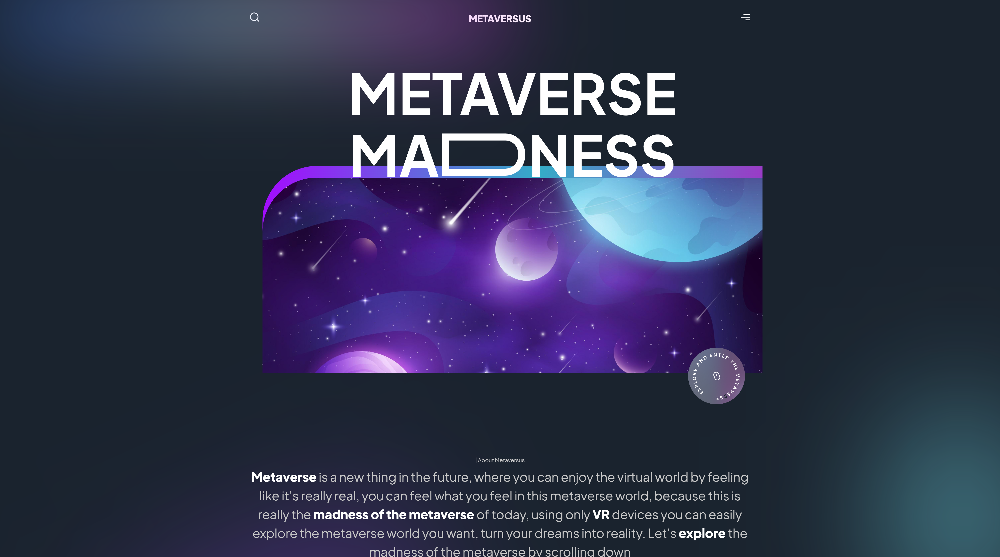

<h1 align="center"> Metaversus </h1>

> Check the live demo in: [Metaversus](https://metaversus-gustavohdab.vercel.app/)

  <a href="#-tecnologias">Tecnologias</a>&nbsp;&nbsp;&nbsp;|&nbsp;&nbsp;&nbsp;
  <a href="#-projeto">Projeto</a>&nbsp;&nbsp;&nbsp;&nbsp;&nbsp;&nbsp;</a>

 

  Preview

  

  Mobile preview

    <table>
	    <tr>
    	    <td style="padding:10px">
        	    
      	    </td>
            <td style="padding:10px">
            	
            </td>
        </tr>
    </table>

## 🚀 Tecnologias

Esse projeto foi desenvolvido com as seguintes tecnologias:

- [JavaScript](https://www.javascript.com/)
- [React](https://reactjs.org/)
- [Tailwind.css](https://tailwindcss.com/)
- [Next.js](https://nextjs.org/)
- [Framer Motion](https://www.framer.com/motion/)
- [Git](https://git-scm.com/)
- [GitHub](https://github.com/)

## 💻 Projeto

O Metaversus é um projeto de um site de notícias sobre o mundo dos metaversos, com um design simples e clean e com muita animação devido ao Framer Motion, o site foi desenvolvido com o intuito de praticar o uso do Next.js e do Tailwind.css. O site conta com uma seção de notícias, uma seção de detalhes da notícia e uma seção de contato.

---

Feito com ♥ by Gustavo Batista :wave: [LinkedIn](https://www.linkedin.com/in/gustavo-h-batista/) e [GitHub](https://github.com/gustavohdab)

> > [Presentation Video] Extra

